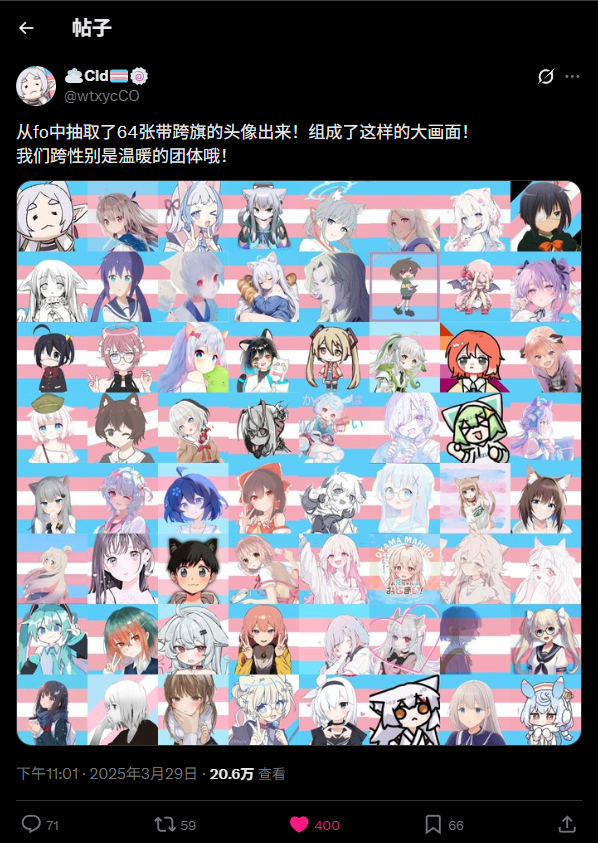

# TransCircle

> 💡 **項目當前狀態**：本項目目前正處於**非常初期的籌備與架構設計階段**。我們深知這個議題的複雜性，因此非常渴望聽取社群夥伴的各種聲音。如果你有任何想法、建議，或者純粹想和我們聊聊這個項目的走向，請隨時與我們交流，您可以[加入項目聊天群](https://transcircle.org/s/x-chat) 或在這個項目透過 issue 的形式提出您的建議。

> “我們的存在，就是對惡意最大的反抗。”

[简体中文](/README-zh_hk.md) [繁體中文-台灣](/README-zh_tw.md) 繁體中文-香港

## 項目溯源

長此以往，中文 X（原 Twitter）MtF 社群有個很奇怪的現象：我們確實有比較全面的社群 wiki、HRT 指南等，但幾乎沒有一個能見證我們社群存在與抗爭的地方。

如果非要說的話，[one-among.us](https://one-among.us) 算是一個，但它只記錄了離去的人們，予以她們安息和予以我們緬懷的地方。

但這不是全部。

跨性別社群流動性極大，因為很多人在完成轉變後順利地融入了社會，離開了這個社群。也有一些人在社會的惡意下選擇了離開。

這裡發生過很多故事，但沒有人把它們完整地記錄下來過。

於我個人而言，萌生這個想法是因為在 X 上刷到的一個推文：

> 

> [X 上的 ☁️Cld🏳️‍⚧️🍥：“從fo中抽取了64張帶跨旗的頭像出來！組成了這樣的大畫面！ 我們跨性別是溫暖的團體哦！](https://x.com/wtxycCO/status/1905998653095035205)

然而，時至今日，原貼主都已不在人世...

雖說我們的存在，就是對惡意最大的反抗吧，但我們很難每次都戰勝惡意。我們不斷見到有人離去。但我們需要讓社群內外的人知道，我們從未妥協，我們一直在努力地抗爭。

因此，這個女性傾向跨性別社群史官工程（TransCircle.org）應運而生。我們希望，至少從現在開始，把我們的故事歸檔記錄，團結社群，爭取跨性別權利。

**我們深信歷史終將向前。希望在將來的某一天，當後代在歷史書中讀到我們如今的掙扎與遭遇時，會像我們今天回看那些古老而荒謬的偏見一樣，感到不可思議和難以想像。而這份記錄，就是我們走過長夜的鐵證。**

## 項目組成

> **請注意：下面的內容是構想中的項目組成，暫未全面實現。**

### ✍️ 故事徵集

我們希望徵集社群中女性傾向跨性別者的各種故事，包括但不限於性別認同的探索、HRT、出櫃等各種故事和想法。

### 👤 人物歸檔

性別探索是一個過程，在確定自己的性別認同後加入到社群中的人們難以了解之前發生的故事。我們希望補齊這個缺憾。

有很多曾經的社群人物因為各種原因現在已經不再活躍，為了留下她們的存在，我們會透過各種方式收集她們的故事。您也可以對這方面提交投稿。

### 🤝 社群互助

如果您有任何有關 HRT 等方面的資源，也歡迎進行投稿。雖然推薦您投稿到 [Project-Trans](https://github.com/project-trans) 的項目中避免資源分散，但我們也接受投稿。

考慮到 [Project-Trans](https://github.com/project-trans) 通常使用 GitHub 投稿，我們也提供更低門檻的表單投稿方式。

## 🔒 私隱、安全與開源協議

我們將會接收匿名投稿，但建議您首選透過 X 或 GitHub OAuth 登入避免冒充或濫用。如果您擔心私隱問題，請使用匿名投稿，但我們會仔細審查避免冒充。

您的所有投稿預設不會公開投稿者。如果您希望公開，請註明。

您的所有投稿將以 [CC BY SA 4.0 or later](https://creativecommons.org/licenses/by-sa/4.0/) 共享。歡迎社群其他項目根據此協議使用我們的內容。

## 如何參與

1. **加入項目組**：[填寫表單](https://transcircle.org/s/join) ，審核後加入我們的 X 群組和 GitHub 組織。

2. **投稿**：使用投稿頁面，分享您的故事

3. **技術支援**：對我們的項目提 issue 或 PR

**如果您希望提供技術支援，請參考 [TODO](TODO.md)**
